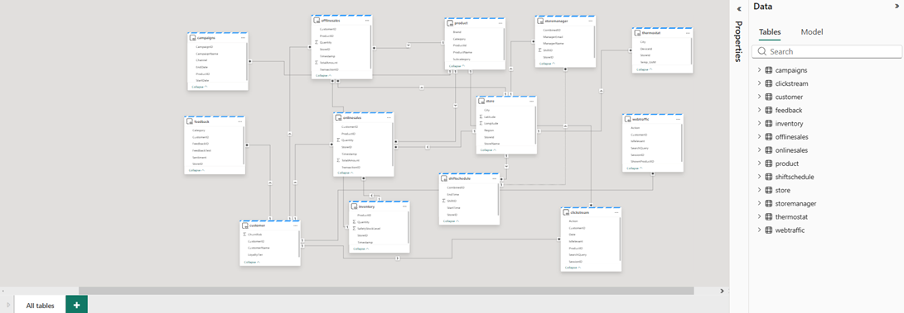
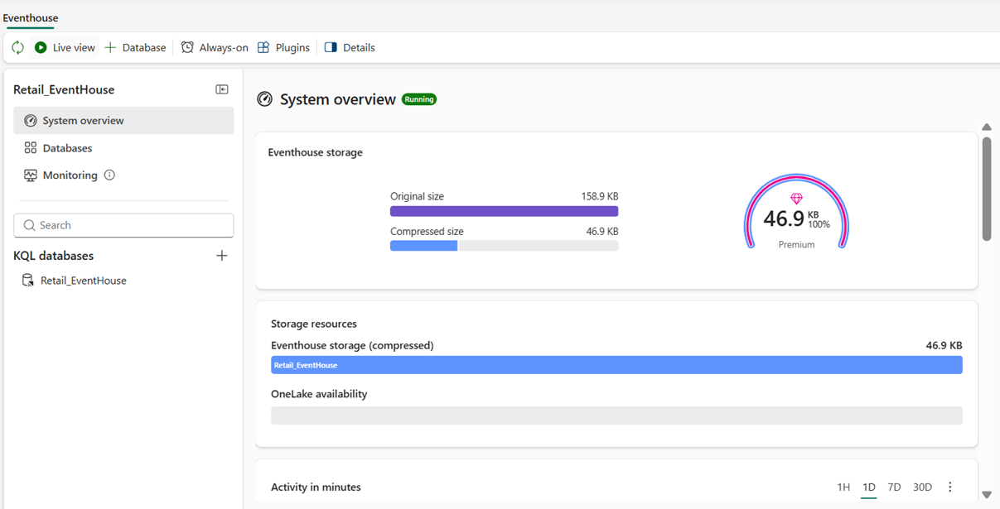
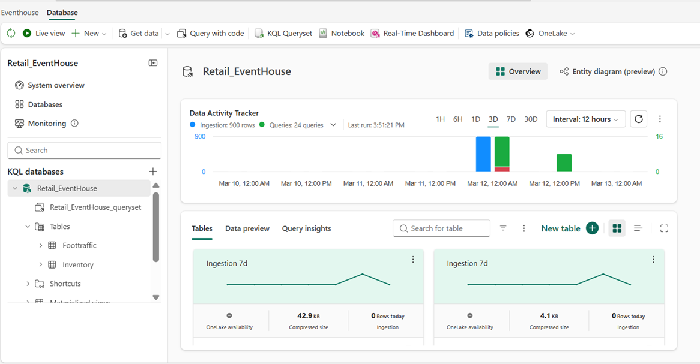
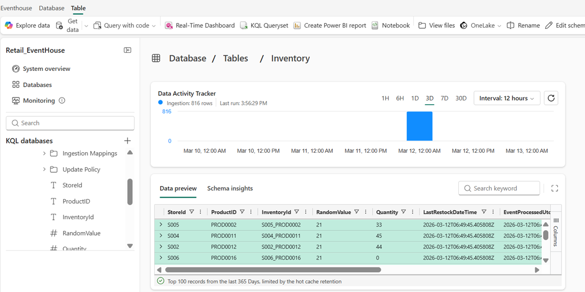
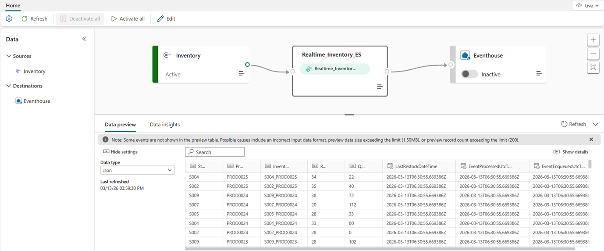

# Fabric Ontology

## Fabric Lakehouse
Fabric Lakehouse provides the governed data layer from which the Semantic Model is created, enabling Ontology IQ to understand business entities, metrics, and relationships for intelligent AI-driven analytics. If you dont have 

Below are asic objects considered for the Retail Ontology:
|Schema            |Table                  |Description                  |
|------------------|-----------------------|-----------------------------|
|Marketing            |Campaign                  |Campaign related data                  |
|Marketing            |Customer                  |Customer information                  |
|Sales            |offlinesales                  |Store sales details                  |
|Sales            |onlinesales                  |Online sales/ecommerce data                  |
|Operation            |Inventory                  |Product inventory details                  |
|Operation            |Sales                  |Sales operation details                  |
|Operation            |StoreInventory                  |Store level inventory                   |
|DigitalExperience            |clickstream                  |Customer visited information                  |
|DigitalExperience            |feedbacks                  |Customer feedback on sales                  |
|DigitalExperience            |webtraffic                  |Customer footprint on purchase                  |

## Creating Semantic Model using Lakehouse
*	Build a business-friendly semantic layer for retail analytics.
*	Creating domain and business specific calculated measures and KPIs
*	Establishing relationship among objects.
  

### Creating RTI in Eventhouse
* Eventhouse: 
  Eventhouse is the real-time analytics engine that stores streaming events and enables fast KQL-based queries for live dashboards and operational intelligence.
  + Retail_Eventhouse created to store streaming data coming from EventHub/Kafka
  + Database created as default while creating eventhouse.
    
  + Table creation in Eventhouse
    
  + As a best practive, following points should be considered while designing table
    -	Minimal columns for streaming tables
    -	Datetime datatype for event time
    -	Avoid excessive string columns
    -	Enable retention policies
      

•	Eventstream: Eventstream ingests and processes real-time events from multiple sources and routes them to Eventhouse, where the data is stored and analyzed using KQL to power real-time dashboards and operational insights. Here we can use the source system as Custom Endpoint, Eventhu, AMQP, and Kafka.

  + Eventstream Configuration:
    -	In this case, we used custom endpoint where scheduled notebook will call EventHubProducerClient (Producer) to publish the data 
    -	Eventstream will read the stream and process it and store to the target location as Eventhouse (Given Eventhouse table)
    -	Below notebooks are used to process the stream data
      |Spark Notebook            |Description                  |
      |--------------------------|-----------------------------|
      |Generate Realtime Foot Traffic Data            |Foot traffic synthesize data to be processed as streaming |
      |Generate Realtime Inventory Data            |Realtime inventory synthesize data                 |

    

