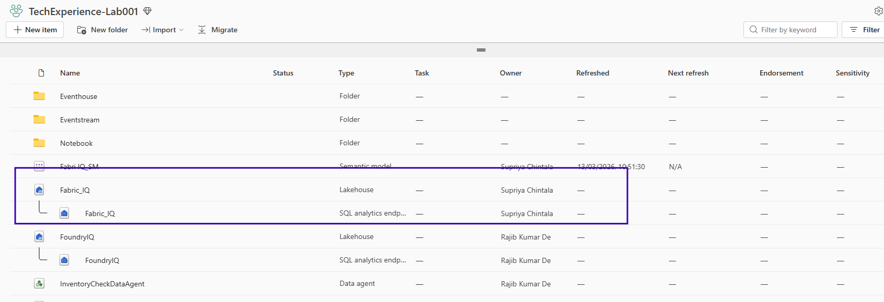

# Fabric Ontology

## Fabric Lakehouse
Fabric Lakehouse provides the governed data layer from which the Semantic Model is created, enabling Ontology IQ to understand business entities, metrics, and relationships for intelligent AI-driven analytics. If you dont have 

